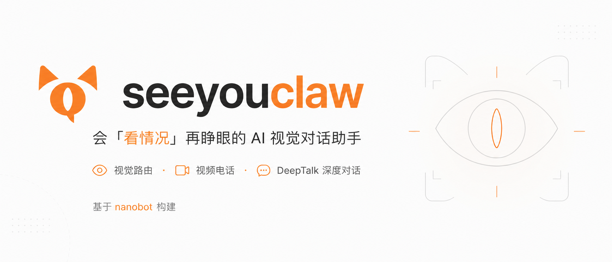
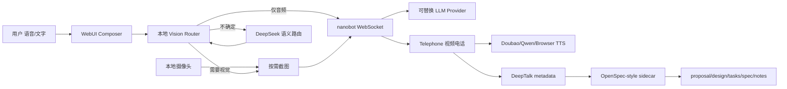

<div align="center">

**seeyouclaw** — 会「看情况」再睁眼的 AI 视觉对话助手

<p>
  
  
  <a href="https://github.com/wuduher/seeyouclaw"></a>
  <a href="./docs/seeyouclaw-design.md"></a>
</p>

<p>
  基于 <a href="https://github.com/HKUDS/nanobot">nanobot</a> 构建 · 视觉路由 + 视频电话 + DeepTalk 深度对话
</p>

</div>

---

**seeyouclaw** 在 nanobot 的轻量 Agent 与 WebUI 之上，实现「注意力路由」：平时只听你说，只有在意图需要时才截取摄像头画面、调用视觉模型。普通文字或语音聊天不上传画面；说「看看这个」「我穿什么」或追问「这个颜色？」时才触发视觉快照。

## 比赛提交

| 项目 | 内容 |
|---|---|
| 赛题 | 题目一：AI 视觉对话助手 |
| 核心规格 | 打开摄像头与麦克风，让 AI 在需要时看到画面、听到用户说话，并自然回应 |
| Demo 视频 | [百度网盘：seeyouclaw demo.mp4](https://pan.baidu.com/s/1VQRu3GdKAZvhcu2gKBoEFw)，提取码：`dv7y` |
| 设计文档 | [docs/seeyouclaw-design.md](./docs/seeyouclaw-design.md) |
| 基础项目 | 二次开发自 [HKUDS/nanobot](https://github.com/HKUDS/nanobot)，保留 nanobot 的 Agent/WebUI/provider 架构 |

## 从这里开始

| 你想… | 去看 |
|---|---|
| 直接看比赛演示 | [Demo 视频](https://pan.baidu.com/s/1VQRu3GdKAZvhcu2gKBoEFw)，提取码：`dv7y` |
| 了解比赛方案与架构 | [seeyouclaw 设计说明](./docs/seeyouclaw-design.md) |
| 配置 DeepSeek + DashScope + 豆包（文本 / 视觉 / ASR / TTS） | [Provider 配置](./docs/seeyouclaw-provider-setup.md) |
| 安装并跑通第一条对话 | [安装](#安装) → [快速开始](#快速开始) → [WebUI 验收](#webui-验收) |
| 查 nanobot 通用能力（频道、MCP、部署等） | [nanobot 文档索引](./docs/README.md) |

## 设计原则

| 原则 | 在 seeyouclaw 中的落地 |
|---|---|
| **产品做减法** | 产品规格收束成一句话：像打视频电话一样与 AI 对话；AI 默认只听，只有被问题需要时才看。不是堆功能，而是用「语音 + 摄像头 + 注意力路由」覆盖日常询问、看物体、读屏幕、情绪沟通和长讨论。 |
| **架构做乘法** | 视觉路由、Telephone、DeepTalk 都是 nanobot 之上的薄模块：复用原有 WebSocket、chat/session、provider、media、memory 和工具链。新增能力尽量变成可复用模块，而不是把逻辑写死在一个 demo 页面里。 |
| **测试是必选项** | 路由、摄像头快照、Telephone 页面、DeepTalk sidecar、TTS provider fallback 都有单元或前端测试覆盖；README 下方列出可复现的验收命令，避免只停留在“能编译”。 |

## 已实现能力

| 模块 | 说明 |
|---|---|
| **视觉智能路由** | rule-based router 先判断显式视觉、屏幕/OCR、隐式指代、情绪线索和上下文 slot；不确定时再调用 DeepSeek Flash judge，避免每句话都上传画面。 |
| **本地摄像头** | WebUI 内授权、预览、按需单帧截图；默认不上传视频流，只在路由结果为 `vision_snapshot` 时附带当前帧。 |
| **语音输入** | DashScope `Qwen3-ASR-Flash` 云端转写；未配置时回退浏览器语音识别；Telephone 中加入不完整话语缓冲，减少用户话没说完就发送。 |
| **Telephone 视频电话** | `#/telephone` 页面提供摄像头预览、通话状态、WebSocket 对话流、语音识别和 AI 语音播报。 |
| **自然语音输出** | Telephone TTS 优先豆包 V3 双向流式语音合成，其次 Qwen Omni 语音，再兜底浏览器 SpeechSynthesis；页面显示当前 provider，便于演示排障。 |
| **DeepTalk 深度讨论** | Telephone 内可打开 `DEEPTALK`，让普通通话进入更主动的长讨论模式，并把讨论沉淀成 OpenSpec-inspired 项目文件。 |
| **模型切换** | 纯文本走 DeepSeek Flash；带图消息自动切 DashScope `Qwen3-Omni-Flash`；TTS/ASR/vision provider 都保持可替换。 |
| **成本可控** | 默认 `audio_only`；JPEG 降采样；路由 cooldown；DeepTalk sidecar 本地化；只在证据型问题触发 DeepResearch/subagent gate。 |

## 实现拆解

### 1. 文字能力上的视觉模块

普通 nanobot 对话默认是文本/语音输入、文本输出。seeyouclaw 在这个基础上加了一个「视觉注意力层」：

- 前端 composer 维护摄像头本地预览和最近视觉上下文，但不会持续上传视频。
- 本地 rule-based router 先处理高置信场景，例如“看一下这个”、屏幕/OCR、物体颜色、`这个/现在/这行` 等隐式指代。
- 当规则判断为 `no_visual_need` 但语义仍可能需要视觉时，后端 `/api/seeyouclaw/vision-route` 调用 DeepSeek Flash 做 LLM judge。
- 路由结果决定是否截取单帧并复用 nanobot 既有图片附件链路；带图消息自动切到视觉模型，纯文本保持低成本模型。

这部分的目标不是“让 AI 一直看”，而是让 AI 学会什么时候值得看。

### 2. Telephone 模块

Telephone 是作品的主交互入口之一，模拟视频电话体验，但仍复用 nanobot 的同一条 chat/session/WebSocket 链路：

- 摄像头：通话页面内显示本地视频预览，和普通 composer 的摄像头能力共用浏览器授权模型。
- 麦克风：优先云端 ASR，失败时可回退浏览器识别；对“我是说...”这类未完成片段做延迟缓冲，降低误截断。
- 对话：识别后的用户话语通过 nanobot WebSocket 进入原有 agent loop，保留上下文、工具、memory 与 provider 配置。
- 语音播报：后端保护接口 `/api/seeyouclaw/telephone-speech` 将最终 assistant 文本转成音频；优先豆包 V3 WebSocket TTS，失败再回退 Qwen / 浏览器。
- 演示可观测性：页面状态显示 `Doubao voice`、`Qwen voice` 或 fallback reason，方便比赛现场解释语音链路。

### 3. Telephone DeepTalk 模块

DeepTalk 是 Telephone 的可选增强模式，用来覆盖情感沟通、科研想法探索、文章/博客式长讨论等需要长上下文和主动提问的场景：

- 入口是 Telephone 页面里的 `DEEPTALK` toggle，不 fork 新应用。
- 每轮用户话语带上 `seeyouclaw_deeptalk` metadata，后端把 DeepTalk contract 注入 nanobot runtime context。
- DeepTalk sidecar 在本地维护 `.seeyouclaw/deeptalk/projects/...`，把对话沉淀为 `proposal.md`、`design.md`、`tasks.md`、`specs/main/spec.md`、`notes.md`。
- 主动性来自三类信号：OpenSpec-inspired SDD 提问、对用户情绪/意图/多模态观察的共情式提问、hook-driven nudges。
- 当话题需要外部证据、论文、竞品、benchmark 或代码库调查时，DeepTalk 通过 DeepResearch gate 判断是否需要 subagent；普通情绪陪伴和早期想法孵化不会滥用 deep research。

DeepTalk 的定位是：让一次视频电话不只得到一段回答，而能逐步变成一个可继续推进的项目。

## 架构概览



更多边界与成本控制见 [设计文档](./docs/seeyouclaw-design.md)。

## 安装

**前置**：Python 3.11+。开发 WebUI 前端时需 Node.js。

从本仓库源码安装（推荐，含 seeyouclaw 全部改动）：

```bash
git clone https://github.com/wuduher/seeyouclaw.git
cd seeyouclaw
python -m pip install -e .
nanobot --version
```

也可使用上游 PyPI 包 `nanobot-ai`，但 **不含** seeyouclaw 的视觉路由与 ASR 扩展，比赛验收请用本仓库。

## 快速开始

**1. 初始化**

```bash
nanobot onboard
```

**2. 配置 API Key**

在启动 gateway 的终端中设置（勿写入 git）：

```powershell
# Windows PowerShell
$env:DEEPSEEK_API_KEY = "<your-deepseek-key>"
$env:DASHSCOPE_API_KEY = "<your-dashscope-key>"
$env:DOUBAO_TTS_API_KEY = "<your-doubao-tts-key>"
```

完整 `~/.nanobot/config.json` 片段见 [Provider 配置](./docs/seeyouclaw-provider-setup.md)。

**3. 验证 CLI**

```bash
nanobot status
nanobot agent -m "用一句话介绍 seeyouclaw。"
```

## WebUI 验收

**1.** 在 `~/.nanobot/config.json` 启用 WebSocket：

```json
{ "channels": { "websocket": { "enabled": true } } }
```

**2.** 启动 gateway：

```bash
nanobot gateway
```

**3.** 浏览器打开 [`http://127.0.0.1:8765`](http://127.0.0.1:8765)

<p align="center">
  
</p>

**建议演示路径**

1. 纯文字聊天 → 路由应显示 **Audio only**，不上传摄像头帧
2. 开启摄像头，问「我穿什么衣服」→ 触发 **Vision snapshot** + Qwen 视觉回复
3. 问「我的椅子是什么颜色的」→ DeepSeek 语义路由补判后触发视觉
4. 打开 `#/telephone` → 通过麦克风对话，确认 AI 回复由 **Doubao voice** 或 **Qwen voice** 播报
5. 在 Telephone 中打开 `DEEPTALK` → 进行情感、科研想法或长文讨论，右侧 Project 面板应持续更新问题、任务和主动信号

开发 WebUI 前端（HMR）见 [`webui/README.md`](./webui/README.md)。

## 测试与工程质量

| 层级 | 验收方式 |
|---|---|
| Python 后端 | `pytest tests/webui/test_seeyouclaw_telephone.py tests/webui/test_seeyouclaw_deeptalk.py tests/webui/test_seeyouclaw_mode.py -q` |
| 前端路由/页面 | `cd webui && npm run test -- seeyouclaw api` |
| 前端规范 | `cd webui && npm run lint` |
| 生产构建 | `cd webui && npm run build` |
| 真实链路 smoke | 启动 `nanobot gateway` 后，打开 WebUI/Telephone，验证摄像头、麦克风、视觉路由、TTS provider 标签和 DeepTalk Project 面板 |

比赛开发过程中按功能拆分 PR：foundation、ASR、视觉路由、Telephone、DeepTalk、语音合成与文档分别提交，避免最后一次性导入。测试覆盖关注“能不能信任 AI 生成代码”：关键逻辑必须有可重复运行的测试，而不是只依赖演示当天手感。

## 代码结构（seeyouclaw 增量）

```
webui/src/lib/seeyouclaw/          # 视觉路由、模型切换
webui/src/hooks/seeyouclaw/        # 摄像头与路由 hook
webui/src/components/seeyouclaw/   # Composer / Telephone / DeepTalk UI 集成点
nanobot/webui/seeyouclaw_vision_route.py   # DeepSeek 语义路由 API
nanobot/webui/seeyouclaw_telephone.py      # Telephone TTS provider fallback
nanobot/webui/seeyouclaw_deeptalk.py       # DeepTalk project sidecar
nanobot/webui/seeyouclaw_mode.py           # Telephone / DeepTalk runtime metadata
docs/seeyouclaw-design.md          # 设计、用户故事、成本控制
docs/seeyouclaw-provider-setup.md  # DeepSeek / DashScope 配置
```

## 文档

| 文档 | 内容 |
|---|---|
| [seeyouclaw-design.md](./docs/seeyouclaw-design.md) | 用户故事、架构、PR 计划、成本控制 |
| [seeyouclaw-provider-setup.md](./docs/seeyouclaw-provider-setup.md) | DeepSeek Flash、Qwen ASR、Qwen Omni 视觉、Telephone 语音 |
| [seeyouclaw-deeptalk.md](./docs/seeyouclaw-deeptalk.md) | DeepTalk 的 SDD 提问、主动性、observation window、DeepResearch gate |
| [docs/README.md](./docs/README.md) | nanobot 通用文档索引 |
| [nanobot.wiki](https://nanobot.wiki) | 上游稳定版文档 |

## 与上游 nanobot 的关系

本仓库 fork 自 [HKUDS/nanobot](https://github.com/HKUDS/nanobot)。CLI 命令仍为 `nanobot`，配置目录仍为 `~/.nanobot/`。seeyouclaw 的增量代码集中在 `webui/src/**/seeyouclaw/` 与少量后端 API，对 nanobot 核心仅保留薄集成点。

## 更新记录

- **2026-06-12** 拆分并合并 stacked PR：foundation → ASR → 视觉闭环 + DeepSeek 语义路由
- **2026-06-12** 新增 DashScope Qwen ASR、DeepSeek 语义视觉路由、上下文 slot 与 demo 测试
- **2026-06-14** 合并 Telephone、DeepTalk、豆包 TTS、OpenSpec-inspired sidecar 与比赛 README 文档

## License

MIT — 与上游 nanobot 相同。详见 [LICENSE](./LICENSE)。

<p align="center">
  <em>Thanks for visiting ✨ seeyouclaw!</em>
</p>
