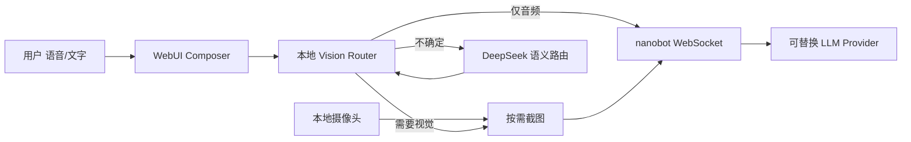

<div align="center">

**seeyouclaw** — 会「看情况」再睁眼的 AI 视觉对话助手

<p>
  
  
  <a href="https://github.com/wuduher/seeyouclaw"></a>
  <a href="./docs/seeyouclaw-design.md"></a>
</p>

<p>
  基于 <a href="https://github.com/HKUDS/nanobot">nanobot</a> 构建 · 专注 WebUI 语音 + 摄像头 + 按需视觉路由
</p>

</div>

---

**seeyouclaw** 在 nanobot 的轻量 Agent 与 WebUI 之上，实现「注意力路由」：平时只听你说，只有在意图需要时才截取摄像头画面、调用视觉模型。普通文字或语音聊天不上传画面；说「看看这个」「我穿什么」或追问「这个颜色？」时才触发视觉快照。

## 从这里开始

| 你想… | 去看 |
|---|---|
| 了解比赛方案与架构 | [seeyouclaw 设计说明](./docs/seeyouclaw-design.md) |
| 配置 DeepSeek + DashScope（文本 / 语音 / 视觉） | [Provider 配置](./docs/seeyouclaw-provider-setup.md) |
| 安装并跑通第一条对话 | [安装](#安装) → [快速开始](#快速开始) → [WebUI 验收](#webui-验收) |
| 查 nanobot 通用能力（频道、MCP、部署等） | [nanobot 文档索引](./docs/README.md) |

## 已实现能力

| 模块 | 说明 |
|---|---|
| **语音输入** | DashScope `Qwen3-ASR-Flash` 云端转写；未配置时回退浏览器语音识别 |
| **本地摄像头** | WebUI 内授权、预览、按需单帧截图（默认不上传流） |
| **规则视觉路由** | 显式视觉请求、屏幕/OCR、隐式指代、情绪线索、45s 上下文 slot、2.5s cooldown |
| **语义视觉路由** | 本地规则不确定时，调用 DeepSeek Flash `/api/seeyouclaw/vision-route`（如「我的椅子是什么颜色的」） |
| **模型切换** | 纯文本走 DeepSeek Flash；带图消息自动切 DashScope `Qwen3-Omni-Flash` |
| **成本可控** | 默认 `audio_only`；JPEG 降采样；复用 nanobot 既有图片上限与 WebSocket 协议 |

## 架构概览



更多边界与成本控制见 [设计文档](./docs/seeyouclaw-design.md)。

## 安装

**前置**：Python 3.11+。开发 WebUI 前端时需 Node.js。

从本仓库源码安装（推荐，含 seeyouclaw 全部改动）：

```bash
git clone https://github.com/wuduher/seeyouclaw.git
cd seeyouclaw
python -m pip install -e .
nanobot --version
```

也可使用上游 PyPI 包 `nanobot-ai`，但 **不含** seeyouclaw 的视觉路由与 ASR 扩展，比赛验收请用本仓库。

## 快速开始

**1. 初始化**

```bash
nanobot onboard
```

**2. 配置 API Key**

在启动 gateway 的终端中设置（勿写入 git）：

```powershell
# Windows PowerShell
$env:DEEPSEEK_API_KEY = "<your-deepseek-key>"
$env:DASHSCOPE_API_KEY = "<your-dashscope-key>"
```

完整 `~/.nanobot/config.json` 片段见 [Provider 配置](./docs/seeyouclaw-provider-setup.md)。

**3. 验证 CLI**

```bash
nanobot status
nanobot agent -m "用一句话介绍 seeyouclaw。"
```

## WebUI 验收

**1.** 在 `~/.nanobot/config.json` 启用 WebSocket：

```json
{ "channels": { "websocket": { "enabled": true } } }
```

**2.** 启动 gateway：

```bash
nanobot gateway
```

**3.** 浏览器打开 [`http://127.0.0.1:8765`](http://127.0.0.1:8765)

<p align="center">
  
</p>

**建议演示路径**

1. 纯文字聊天 → 路由应显示 **Audio only**，不上传摄像头帧
2. 开启摄像头，问「我穿什么衣服」→ 触发 **Vision snapshot** + Qwen 视觉回复
3. 问「我的椅子是什么颜色的」→ DeepSeek 语义路由补判后触发视觉

开发 WebUI 前端（HMR）见 [`webui/README.md`](./webui/README.md)。

## 代码结构（seeyouclaw 增量）

```
webui/src/lib/seeyouclaw/          # 视觉路由、模型切换
webui/src/hooks/seeyouclaw/        # 摄像头与路由 hook
webui/src/components/seeyouclaw/   # UI 集成点
nanobot/webui/seeyouclaw_vision_route.py   # DeepSeek 语义路由 API
docs/seeyouclaw-design.md          # 设计、用户故事、成本控制
docs/seeyouclaw-provider-setup.md  # DeepSeek / DashScope 配置
```

## 文档

| 文档 | 内容 |
|---|---|
| [seeyouclaw-design.md](./docs/seeyouclaw-design.md) | 用户故事、架构、PR 计划、成本控制 |
| [seeyouclaw-provider-setup.md](./docs/seeyouclaw-provider-setup.md) | DeepSeek Flash、Qwen ASR、Qwen Omni 视觉 |
| [docs/README.md](./docs/README.md) | nanobot 通用文档索引 |
| [nanobot.wiki](https://nanobot.wiki) | 上游稳定版文档 |

## 与上游 nanobot 的关系

本仓库 fork 自 [HKUDS/nanobot](https://github.com/HKUDS/nanobot)。CLI 命令仍为 `nanobot`，配置目录仍为 `~/.nanobot/`。seeyouclaw 的增量代码集中在 `webui/src/**/seeyouclaw/` 与少量后端 API，对 nanobot 核心仅保留薄集成点。

## 更新记录

- **2026-06-12** 拆分并合并 stacked PR：foundation → ASR → 视觉闭环 + DeepSeek 语义路由
- **2026-06-12** 新增 DashScope Qwen ASR、DeepSeek 语义视觉路由、上下文 slot 与 demo 测试

## License

MIT — 与上游 nanobot 相同。详见 [LICENSE](./LICENSE)。

<p align="center">
  <em>Thanks for visiting ✨ seeyouclaw!</em>
</p>
