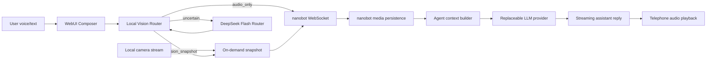

# seeyouclaw Design Notes

seeyouclaw builds on nanobot's WebUI and provider architecture to create an AI
visual conversation assistant. The core product bet is attention routing: the
assistant listens naturally, but only spends camera and visual-model budget when
the user's intent or state needs it.

## User Stories

Planned for the competition build:

- As a user, I can speak through the microphone and turn speech into a chat
  message.
- As a user, I can enable the camera in WebUI and see a local preview.
- As a user, when I ask "look at this" or mention my screen, seeyouclaw captures
  a fresh camera frame and sends it with the message.
- As a user, ordinary text or voice chat does not upload camera frames.
- As a developer/judge, I can see the current routing decision, such as
  `Audio only` or `Vision snapshot`.
- As a user, I can open a telephone-style subpage for a camera-on voice call
  experience while keeping the same nanobot chat context.
- As a developer, I can replace the model provider without rewriting the camera
  or routing code.
- As a demo presenter, I can explain which operating-cost controls are active.

Implemented in the first pass:

- Microphone transcription keeps nanobot's WebUI flow, with browser speech
  recognition fallback when no cloud transcription provider is configured.
- Camera permission, local preview, and one-frame snapshot capture are available
  in the composer.
- A pure `seeyouclaw` vision router detects visual requests, screen/OCR prompts,
  implicit references, stress cues, cooldown, and image-limit conditions.
- The router keeps a short-lived semantic slot for active visual topics such as
  appearance, screen, scene, and emotion, so follow-ups like `now?`, `this
  color?`, or `this line?` can still route to vision without repeating the full
  visual intent.
- A DeepSeek Flash-assisted router runs only after the local router returns
  `no_visual_need`. It catches broader object-attribute questions such as
  `my chair color`, stronger emotion shifts, and semantic-slot follow-ups
  without hard-coding every object noun.
- A `#/telephone` subpage provides a video-call surface with camera preview,
  browser speech recognition, nanobot-backed streaming replies, optional Qwen
  Omni audio playback, and browser speech synthesis fallback.
- Triggered snapshots are appended to the existing WebSocket image attachment
  payload, so no protocol fork is needed.
- Router unit tests cover audio-only, visual trigger, disabled camera, image
  limit, and cooldown behavior.
- Composer loop tests cover the first stable demo path: text-only turns stay
  text-only, visual turns attach exactly one camera snapshot, and camera failure
  falls back to a text turn with an inline notice.
- DeepSeek Flash configuration is documented as a replaceable provider preset.

Stable loop before intelligence:

- The first demo loop must work with manual camera enablement, voice-to-text,
  one routed snapshot, and a streamed model reply.
- Profile, emotion routing, burst capture, and local scene-change detection stay
  behind this baseline. They are useful only after the basic loop is reliable.

Deferred after the stable loop:

- Full-duplex voice playback with interruption.
- Multi-frame burst capture for motion or posture understanding.
- User profile persistence with explicit clear/export controls.
- Separate routing between a cheap text model and a stronger vision model.
- Local lightweight scene-change detection before cloud vision calls.

## Architecture

Important boundaries:

- Camera stream stays in the browser until a route explicitly asks for a frame.
- Snapshots reuse nanobot image attachments and media persistence.
- Provider selection remains in `modelPresets`, so the camera pipeline does not
  depend on one vendor.
- Telephone mode sends user utterances through the same WebSocket chat session,
  so existing context replay, memory consolidation, workspace scope, and tools
  continue to work.
- Qwen Omni telephone speech is a protected WebUI API that turns the final
  assistant text into audio. It is intentionally outside the main agent loop so
  it cannot fork memory or mutate conversation history.
- The router is a pure TypeScript module, ready to be replaced by a small intent
  classifier if rules are not enough.
- The LLM router is a protected WebUI API and never writes into the chat
  transcript. If it times out or returns malformed JSON, the composer falls back
  to the local route.
- New code lives under `webui/src/lib/seeyouclaw`,
  `webui/src/hooks/seeyouclaw`, and `webui/src/components/seeyouclaw` where
  possible. Existing nanobot components keep thin integration points only.

## Cost Controls

Considered:

- Keep camera local until needed.
- Use intent routing before uploading frames.
- Prefer one low-resolution snapshot before any multi-frame burst.
- Add cooldown so repeated visual turns cannot upload every message.
- Reuse manual image attachments instead of adding an extra camera frame.
- Cap images per message.
- Cache visual summaries when the scene does not change.
- Split providers: cheap/fast text model by default, vision model only for
  image-heavy turns.
- Maintain a lightweight user profile so the assistant asks fewer redundant
  questions.

Actually adopted in the first pass:

- Camera is opt-in and local-preview first.
- The router defaults to `audio_only`.
- Visual uploads happen only for explicit visual, screen/OCR, implicit reference,
  or stress-cue triggers.
- Short-lived semantic slots keep follow-up turns contextual without forcing
  continuous camera use.
- DeepSeek Flash routing is only called for locally ambiguous text turns, so
  obvious visual requests stay low-latency and ordinary turns avoid extra
  provider calls.
- Snapshot capture has a 2.5 second cooldown.
- Existing `MAX_IMAGES_PER_MESSAGE` prevents runaway attachment uploads.
- Manual attachments suppress redundant camera snapshots when no visual trigger
  exists.
- Snapshot resolution is downscaled to a maximum width of 960px and encoded as
  JPEG at quality `0.72`.
- DeepSeek Flash is configured with `reasoningEffort: "none"` for lower latency
  in the first demo loop.
- Voice input prefers a browser-local fallback before requiring a cloud speech
  provider, which lowers demo friction and keeps operator cost optional.
- Telephone audio playback prefers Qwen Omni only after the assistant has
  produced a final text reply; if that call fails, browser speech synthesis
  keeps the conversation flowing.

## Two-Day PR Plan

PR 1: Camera snapshot router

- Add camera preview and on-demand snapshot capture in WebUI.
- Add pure router rules and unit tests.
- Keep WebSocket protocol unchanged.

PR 2: Provider setup and competition docs

- Add DeepSeek Flash preset documentation.
- Add design notes with user stories and cost controls.
- Update README and docs index links.

PR 3: Voice interaction polish

- Add optional auto-send after transcription.
- Add browser speech synthesis or pluggable TTS output.
- Add interruption/stop affordance for spoken replies.

PR 4: Demo hardening

- Add route/cost counters for the demo.
- Add a sample script covering audio-only, visual snapshot, and cooldown.
- Record demo video and link it from README.

PR 5: Telephone mode

- Add a dedicated video-call subpage.
- Reuse nanobot WebSocket sessions for context and memory compatibility.
- Add Qwen Omni audio playback with browser speech fallback.
